<p align="center"></p>

<p align="center">
  
  
  
  <a href="https://danitechia.vercel.app"></a>
</p>

# Portafolio de Daniel Dans Cots

Este es un portafolio web moderno construido con **React** y **Vite**, diseñado para ser rápido, responsive y fácil de desplegar en Vercel. Incluye un chatbot interactivo y soporte multi-idioma (Español/Inglés).

## Características

-   **Diseño Moderno**: Interfaz limpia con animaciones suaves y diseño responsive.
-   **Multi-idioma**: Cambio instantáneo entre Español e Inglés.
-   **Secciones**: Inicio, Sobre Mí, Proyectos, Contacto.
-   **Tecnologías**: React, Vite, CSS Modules, Lucide React.

## Requisitos Previos

-   Node.js (versión 18 o superior recomendada)

## Instalación

1.  Clona el repositorio o descarga los archivos.
2.  Abre una terminal en la carpeta del proyecto.
3.  Instala las dependencias:

```bash
npm install
```

## Desarrollo

Para iniciar el servidor de desarrollo local:

```bash
npm run dev
```

La aplicación estará disponible en `http://localhost:5173`.

## Construcción para Producción

Para crear la versión optimizada para producción:

```bash
npm run build
```

Para previsualizar la versión de producción localmente:

```bash
npm run preview
```

## Despliegue en Vercel

Este proyecto está preparado para desplegarse fácilmente en [Vercel](https://vercel.com).

1.  Crea una cuenta en Vercel.
2.  Importa este proyecto desde tu repositorio de GitHub.
3.  Vercel detectará automáticamente que es un proyecto Vite y configurará los comandos de construcción.
4.  ¡Haz clic en Deploy!

## Personalización

-   **Textos**: Edita `src/context/translations.js` para cambiar los textos en Español e Inglés.
-   **Proyectos**: Modifica `src/components/Projects/Projects.jsx` para añadir tus propios proyectos.
-   **Estilos**: Los colores globales están en `src/index.css`.

---
*Última actualización: Febrero 2026*
